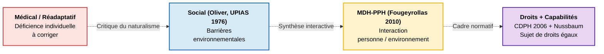

---
hide:
  - navigation
  - toc
---

HETS Genève · Bachelor TS

## Handicap, autonomie et travail social

*Du protégé au sujet de droits — transformations du champ du handicap et nouvelle posture du travail social.*

Site pédagogique du module Bachelor, préparé par **Pierre Brasseur** pour la leçon probatoire du 5 juin 2026 (poste de Professeur HES associé à 80 %, réf. 309).

[:material-presentation: Démarrer la séance probatoire](seance/presentation.md){ .md-button .md-button--primary }
[:material-book-open-variant: Voir le module](module/syllabus.md){ .md-button }

## Quatre points d'entrée

-   :material-presentation:{ .lg .middle } **Séance probatoire**

    ---

    40 minutes d'exposé + 20 minutes de questions, autour de la situation de Léa à L'Atelier de la Fondation Ensemble.

    Six étapes : vignette → modèles → transformations → tensions → activité → synthèse.

    [:octicons-arrow-right-24: Démarrer](seance/presentation.md)

-   :material-book-open-variant:{ .lg .middle } **Module complet**

    ---

    13 séances, 5 ECTS, articulation PEC20, co-animations avec Masse, Lenzi, Souesme, Piérart.

    Modalités d'évaluation et articulation avec la formation pratique.

    [:octicons-arrow-right-24: Voir le syllabus](module/syllabus.md)

-   :material-library:{ .lg .middle } **Bibliographie**

    ---

    64 fiches de lecture structurées (Thèse · Concepts · Citations · Exemple BA · Limite).

    Modèles théoriques, transformations contemporaines, posture professionnelle.

    [:octicons-arrow-right-24: Consulter](ressources/notes-lecture.md)

-   :material-flag:{ .lg .middle } **Cadre suisse**

    ---

    Constitution, LHand, LAI, LIPPI, CDPH ONU 2006/2014, plan cantonal genevois 2023, avant-projet LED-H 2024.

    Initiative *Pour l'inclusion* (107 910 signatures).

    [:octicons-arrow-right-24: Cadre légal](ressources/cadre-suisse.md)

## Les quatre modèles du handicap, en un coup d'œil

!!! tip "L'intuition clé"

    Ces modèles **ne sont pas des étapes successives**. Ils coexistent dans chaque institution comme **grammaires actives**. Reconnaître le modèle dominant d'un dispositif, c'est déjà commencer à y intervenir.

## La frise des transformations 2006-2026

<ul class="hets-timeline">
  <li><strong>2006</strong> · Adoption de la <strong>CDPH</strong> par l'ONU</li>
  <li><strong>2012</strong> · Introduction de la <strong>contribution d'assistance AI</strong> en Suisse (6ᵉ rév. LAI)</li>
  <li><strong>2014</strong> · Ratification de la CDPH par la Suisse (15 avril)</li>
  <li><strong>2022</strong> · Observations finales du <strong>Comité ONU CDPH</strong> sur la Suisse — 80+ recommandations</li>
  <li><strong>2023</strong> · Plan cantonal genevois CDPH, volume 1 (janvier)</li>
  <li><strong>2024</strong> · Avant-projet <strong>LED-H</strong> en consultation (12 juin) · Initiative <em>Pour l'inclusion</em> déposée (5 sept., 107 910 signatures)</li>
  <li><strong>2026</strong> · Contre-projet du Conseil fédéral (message du 25 février)</li>
</ul>

## Trois tensions de posture professionnelle

=== ":material-shield-account: Protection / Autonomie"

    > *« Surprotéger les personnes handicapées, c'est nier leur humanité. Il faut leur restituer le droit au risque ordinaire. »* — Perske 1972

    - Du paradigme tutélaire au paradigme du soutien (**CDPH art. 12**)
    - Éthique du care comme attention située (Tronto, Paperman, Laugier)

    [:octicons-arrow-right-24: Lire en détail](seance/tensions.md#tension-1-protection-autonomie)

=== ":material-account-group: Expertise / Savoir expérientiel"

    > *« Nothing about us without us. »* — Charlton 1998

    - Pair-aidance et savoirs expérientiels (Jouet, Flora & Las Vergnas 2010)
    - Vigilance épistémique sur la division témoin / expert (Brasseur & Rodriguez 2019)

    [:octicons-arrow-right-24: Lire en détail](seance/tensions.md#tension-2-expertise-professionnelle-savoir-experientiel)

=== ":material-briefcase-clock: Travail prescrit / Travail réel"

    > *« Le travail prescrit n'est jamais identique au travail réel. »* — Clot 1999

    - *Street-level bureaucracy* (Lipsky 1980)
    - Autonomie discrétionnaire et marges du métier (Lenzi & Moine 2025)

    [:octicons-arrow-right-24: Lire en détail](seance/tensions.md#tension-3-travail-prescrit-travail-reel)

## Comment naviguer ce site

- **Onglets en haut** : sections principales
- **Menu latéral gauche** : pages détaillées
- **Menu latéral droit** : table des matières de la page
- **Recherche** (icône loupe) : indexée en français
- **Mode sombre** : icône lune/soleil en haut à droite
- **Notes de bas de page** : cliquables, retour automatique
- **Téléchargements** : PDFs disponibles dans [Ressources › Téléchargements](ressources/telechargements.md)

---

*Site publié le 29 mai 2026 · Contenu sous licence CC BY-NC-SA 4.0*
