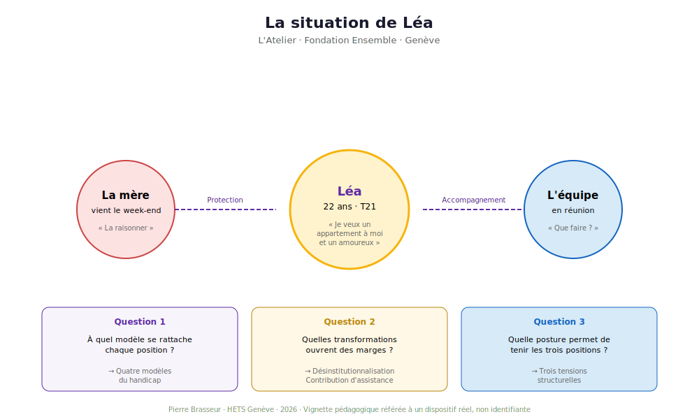
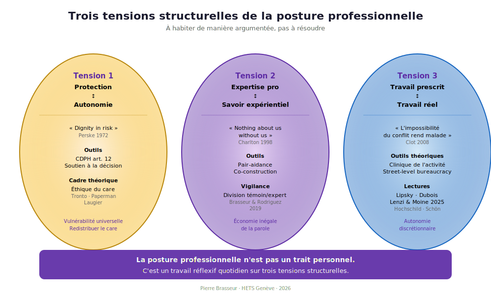

---
tags:
  - Schémas
  - Visualisations
---

# Galerie de schémas

!!! info "Visualiser pour comprendre"

    Cinq schémas synthétiques accompagnent la séance. **Cliquez sur une image** pour l'ouvrir en pleine page (zoom, navigation, téléchargement). Tous les schémas sont en SVG vectoriel — utilisables en projection, en impression ou en réutilisation pédagogique sous licence CC BY-NC-SA 4.0.

## La vignette de Léa

{ loading=lazy }

Référée à L'Atelier de la Fondation Ensemble à Genève. Trois personnages, trois positions, trois questions à garder en tête pendant la séance.

[:material-arrow-right: Lire la vignette](../seance/vignette.md){ .md-button }

## Les quatre modèles du handicap

{ loading=lazy }

Quatre cadres conceptuels coexistants dans chaque institution. Chacun appelle une posture professionnelle distincte et présente un risque propre.

[:material-arrow-right: Lire les modèles](../seance/modeles.md){ .md-button }

## Le modèle MDH-PPH (Fougeyrollas 2010)

{ loading=lazy }

La métaphore du funambule, du fil et de la toile. La situation de handicap n'est ni dans la personne ni dans l'environnement, mais dans leur interaction.

[:material-arrow-right: Approfondir le MDH-PPH](../seance/modeles.md#modele-3-mdh-pph-fougeyrollas-2010){ .md-button }

## Frise chronologique 2006-2026

{ loading=lazy }

De l'adoption de la CDPH par l'ONU au contre-projet du Conseil fédéral. Les jalons suisses et genevois que tout·e TS doit connaître.

[:material-arrow-right: Voir les transformations](../seance/transformations.md){ .md-button }

## Trois tensions de la posture professionnelle

{ loading=lazy }

Protection / Autonomie · Expertise / Savoir expérientiel · Travail prescrit / Travail réel. À habiter de manière argumentée, pas à résoudre.

[:material-arrow-right: Lire les tensions](../seance/tensions.md){ .md-button }

---

## Téléchargement et réutilisation

Tous les schémas sont des fichiers SVG dans `docs/assets/schemas/` :

- `vignette-lea.svg`
- `4-modeles.svg`
- `mdh-pph.svg`
- `timeline-2006-2026.svg`
- `3-tensions.svg`

**Licence CC BY-NC-SA 4.0.** Citation : *Pierre Brasseur, HETS Genève, 2026.*

---

[:material-home: Retour à l'accueil](../index.md){ .md-button .md-button--primary }
