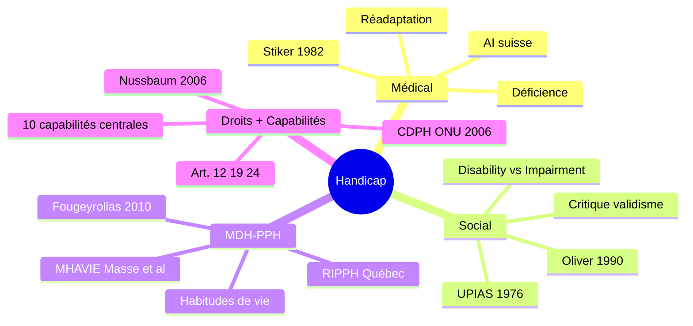

---
tags:
  - Modèles théoriques
  - Oliver
  - Fougeyrollas
  - Nussbaum
  - CDPH
---

# Les quatre modèles du handicap

!!! abstract "Idée centrale"

    Quatre grands modèles structurent la pensée du handicap. Ils **ne sont pas des étapes successives** mais des **grammaires actives** qui coexistent dans chaque institution.

## Modèle 1 — Médical et réadaptatif

**Idée centrale.** Le handicap est une **déficience individuelle à corriger**.

Le modèle émerge à la fin du XIXᵉ siècle avec l'institutionnalisation de la médecine de réadaptation[^stiker]. Il se consolide au sortir des deux guerres mondiales avec l'invalidité de guerre puis du travail. Sa traduction administrative la plus visible en Suisse est l'AI[^lai].

[^stiker]: Stiker, H.-J. (1982/2013). *Corps infirmes et sociétés. Essais d'anthropologie historique* (3ᵉ éd.). Paris : Dunod. Thèse centrale : la modernité construit le paradigme de la « réadaptation » qui *« ramène à la norme, à l'identique, et désigne par là même comme différent »*.

[^lai]: Loi fédérale sur l'assurance-invalidité (LAI), RS 831.20. Voir aussi Tabin, J.-P., Probst, I., Waardenburg, G., & Bruttin, J. (2019). *Repenser la normalité. Réflexions sur l'invalidité*. Lausanne : Antipodes.

**Posture professionnelle qu'il appelle :** le TS comme **technicien de la conformité**. Il accompagne la personne dans son ajustement à des normes implicites de productivité, d'autonomie fonctionnelle, de comportement adapté.

**Risque :** adapter la personne à un environnement non interrogé.

---

## Modèle 2 — Social (Oliver, UPIAS 1976)

**Idée centrale.** Le handicap est **produit par les barrières environnementales**.

Le modèle social britannique opère une rupture conceptuelle radicale : le handicap n'est pas la déficience corporelle (*impairment*) mais le handicap social produit par les barrières (*disability*)[^upias].

[^upias]: UPIAS (1976). *Fundamental Principles of Disability*. Londres : Union of the Physically Impaired Against Segregation. Repris et systématisé par Oliver, M. (1990). *The Politics of Disablement*. Basingstoke : Macmillan.

!!! quote "Formulation princeps (UPIAS 1976)"

    *« Disability is something imposed on top of our impairments by the way we are unnecessarily isolated and excluded from full participation in society. »*

**Posture professionnelle qu'il appelle :** le TS comme **acteur du changement environnemental**. Il agit moins sur la personne que sur les barrières qui la « handicapent ».

**Risque :** minorer la souffrance corporelle et l'expérience subjective de la déficience — critique formulée notamment depuis l'expérience féministe et de la maladie chronique[^crow].

[^crow]: Crow, L. (1996). Including all of our lives : Renewing the social model of disability. In C. Barnes & G. Mercer (Eds.), *Exploring the Divide*. Leeds : The Disability Press, pp. 55-72. Shakespeare, T. (2014). *Disability Rights and Wrongs Revisited* (2ᵉ éd.). Londres : Routledge.

---

## Modèle 3 — MDH-PPH (Fougeyrollas 2010)

**Idée centrale.** Le handicap résulte d'une **interaction** entre facteurs personnels et facteurs environnementaux.

Le **Modèle de développement humain – Processus de production du handicap (MDH-PPH)** développé par Patrick Fougeyrollas et le RIPPH au Québec propose une synthèse interactive[^fougeyrollas].

[^fougeyrollas]: Fougeyrollas, P. (2010). *La funambule, le fil et la toile. Modèles conceptuels appliqués au handicap*. Québec : Presses de l'Université Laval.

!!! quote "Métaphore du funambule"

    La personne (funambule) avance sur un fil (habitudes de vie) tendu dans une toile (environnement). Une **situation de handicap** est ce qui se produit quand la qualité de la toile ne soutient pas le passage.

**Posture professionnelle qu'il appelle :** le TS comme **évaluateur situationnel**. Il cartographie facilitateurs et obstacles, identifie les habitudes de vie compromises, négocie des aménagements.

**Diffusion romande.** C'est ce modèle qui structure la recherche romande sur l'accessibilité et la participation sociale, notamment à la HETS Genève[^masse].

[^masse]: Masse, M., Petitpierre, G., Delessert, Y., Jacquemettaz, M., & Wolf, J.-P. (2018). *Accessibilité et participation sociale. Quelles avancées, quelles résistances ?* Genève : Éditions ies. Cette recherche mobilise le MDH-PPH pour analyser 47 institutions romandes auprès d'environ 7 000 adultes avec déficience intellectuelle.

**Risque :** complexité difficile à opérationnaliser dans des dispositifs administratifs qui exigent des catégorisations fixes.

---

## Modèle 4 — Droits humains et capabilités

**Idée centrale.** La personne est **sujet de droits égaux** ; ce qui compte est la **capabilité réelle**.

### Le pilier droits : la CDPH ONU 2006

La **Convention relative aux droits des personnes handicapées**[^cdph] consacre le passage d'une approche de protection à une approche de droits.

[^cdph]: ONU (2006). *Convention relative aux droits des personnes handicapées* (CDPH). Ratifiée par la Suisse le 15 avril 2014, en vigueur 15 mai 2014.

!!! quote "Préambule, considérant (e)"

    *« Reconnaissant que la notion de handicap évolue et que le handicap résulte de l'interaction entre des personnes présentant des incapacités et les barrières comportementales et environnementales qui font obstacle à leur pleine et effective participation à la société sur la base de l'égalité avec les autres. »*

**Trois articles structurants :**

- **Article 12** — Capacité juridique universelle. Substitue au paradigme de la *substitution de décision* (tutelle, curatelle de portée générale) celui du **soutien à la décision** (*supported decision-making*)[^quinn].
- **Article 19** — Vie autonome et inclusion dans la communauté.
- **Article 24** — Éducation inclusive.

[^quinn]: Quinn, G. (2010). *Personhood and Legal Capacity. Perspectives on the Paradigm Shift of Article 12 CRPD*. Communication, HPOD Conference, Harvard Law School. Comité ONU CDPH (2014). *Observation générale n° 1*. CRPD/C/GC/1.

### Le pilier capabilités : Sen et Nussbaum

L'**approche par les capabilités** initiée par Amartya Sen[^sen] et systématisée pour les personnes handicapées par Martha Nussbaum[^nussbaum] propose une alternative au contractualisme rawlsien.

[^sen]: Sen, A. (1999). *Development as Freedom*. Oxford : Oxford University Press. Pour la transposition au handicap : Mitra, S. (2006). The capability approach and disability. *Journal of Disability Policy Studies*, 16(4), 236-247.

[^nussbaum]: Nussbaum, M. (2006). *Frontiers of Justice. Disability, Nationality, Species Membership*. Cambridge (MA) : Belknap/Harvard. Pour la francophonie : Bonvin, J.-M., & Farvaque, N. (2008). *Amartya Sen. Une politique de la liberté*. Paris : Michalon.

!!! info "Les dix capabilités centrales de Nussbaum"

    1. Vie
    2. Santé corporelle
    3. Intégrité corporelle
    4. Sens, imagination, pensée
    5. Émotions
    6. Raison pratique
    7. **Affiliation** (vivre avec et pour les autres)
    8. Autres espèces
    9. **Jeu**
    10. **Contrôle de son environnement** (politique et matériel)

**Posture professionnelle qu'il appelle :** le TS comme **garant de droits** et **facilitateur de capabilités**. Il connaît le cadre légal, sait l'invoquer, sait l'expliquer ; il évalue moins des « besoins » que des **capabilités à soutenir**.

**Risque :** effectivité variable. Les droits proclamés ne sont pas les droits effectifs — d'où la notion de **droits vulnérables**[^revillard].

[^revillard]: Revillard, A. (2020). *Des droits vulnérables. Handicap, action publique et changement social*. Paris : Presses de Sciences Po. Citation centrale : *« Les droits ne sont pas seulement ce que les textes disent, mais ce que les personnes parviennent à en faire. »*

---

## Grille opérationnelle

| Modèle | Idée centrale | Posture professionnelle | Risque |
|---|---|---|---|
| Médical | Déficience à corriger | Technicien de la conformité | Ne pas interroger l'environnement |
| Social | Barrières environnementales | Acteur du changement | Minorer la souffrance |
| MDH-PPH | Interaction | Évaluateur situationnel | Difficulté à opérationnaliser |
| Droits + capabilités | Sujet de droits, capabilité réelle | Garant de droits | Effectivité variable |

## Cartographie des modèles

!!! tip "À retenir"

    Ces modèles **coexistent** dans chaque institution. Reconnaître le modèle dominant d'un dispositif, c'est déjà commencer à y intervenir.

---

[:octicons-arrow-left-24: Précédent : vignette](vignette.md){ .md-button }
[:octicons-arrow-right-24: Suivant : transformations contemporaines](transformations.md){ .md-button .md-button--primary }
