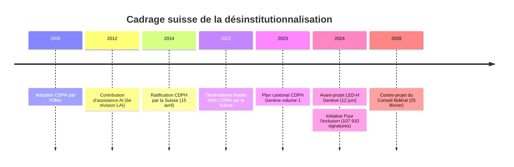

---
tags:
  - Transformations
  - Désinstitutionnalisation
  - Autodétermination
  - Contribution d'assistance
  - Suisse
---

# Transformations contemporaines

!!! abstract "Trois grandes transformations"

    1. **Désinstitutionnalisation** — sortir des grandes institutions vers des services de proximité
    2. **Autodétermination et pair-aidance** — la personne comme agent causal de sa vie
    3. **Financement orienté personne** — *cash-for-care*, contribution d'assistance AI

## 1. Désinstitutionnalisation

### Cadre normatif

L'**article 19 CDPH** pose le droit de *« vivre dans la société, avec la même liberté de choix que les autres personnes »*. Sa mise en œuvre est précisément ce que le Comité ONU CDPH a critiqué dans ses Observations finales sur la Suisse du 13 avril 2022[^onu2022].

[^onu2022]: Comité ONU CDPH (2022). *Observations finales concernant le rapport initial de la Suisse*. CRPD/C/CHE/CO/1. § 41 : *« The Committee is concerned about the lack of a comprehensive deinstitutionalization strategy. »* § 42 : *« adopt a deinstitutionalization strategy with a clear time frame. »*

### Mobilisation politique suisse

| Année | Évènement |
|---|---|
| **2014** | Ratification CDPH par la Suisse (15 avril) |
| **2022** | Observations finales du Comité ONU CDPH (80+ recommandations) |
| **2023** | Plan cantonal genevois CDPH, volume 1 (janvier)[^plan] |
| **2024** | Avant-projet LED-H en consultation (12 juin)[^ledh] |
| **2024** | Initiative *Pour l'inclusion* : 107 910 signatures (5 septembre)[^inclusion] |
| **2026** | Contre-projet du Conseil fédéral, message du 25 février[^contre] |

[^plan]: État de Genève, DCS (2023). *Plan d'action cantonal de mise en œuvre de la CDPH. Volume 1*. Genève.

[^ledh]: État de Genève, DCS (2024). *Avant-projet de Loi sur l'égalité et les droits des personnes handicapées (LED-H)*. Consultation ouverte le 12 juin 2024, co-construite avec ~40 organisations.

[^inclusion]: Comité d'initiative « Pour l'inclusion » (2024). L'initiative demande l'inscription constitutionnelle de l'égalité, de la participation, de l'autodétermination et du droit à l'assistance personnelle.

[^contre]: Conseil fédéral (2026). *Message concernant le contre-projet indirect à l'initiative populaire « Pour l'inclusion »*. Berne, 25 février 2026.

### Précisions critiques

!!! warning "Mansell & Beadle-Brown : la qualité ne dépend pas de la taille"

    *« Community-based services are typically associated with better outcomes than institutional provision, but outcomes vary widely depending on how services are organised. »*[^mansell]

[^mansell]: Mansell, J., & Beadle-Brown, J. (2010). Deinstitutionalisation and community living. *Journal of Intellectual Disability Research*, 54(2), 104-112, p. 106. Position officielle IASSIDD.

La désinstitutionnalisation ne saurait être réduite à la fermeture d'établissements. Sans investissement substantiel dans les services de proximité, elle produit de la **transinstitutionnalisation** ou aggrave les situations de **non-recours**[^enil].

[^enil]: ENIL — *European Network on Independent Living* — documente que des fonds structurels européens continuent à financer la rénovation d'institutions au lieu de l'assistance personnelle.

---

## 2. Autodétermination, agentivité, pair-aidance

### Théorie de l'autodétermination (Ryan & Deci)

Trois besoins psychologiques universels conditionnent la motivation, le bien-être et l'engagement : **autonomie, compétence, appartenance**[^ryandeci].

[^ryandeci]: Ryan, R. M., & Deci, E. L. (2017). *Self-Determination Theory*. New York : Guilford, p. 86 : *« Autonomy, competence, and relatedness are not just preferences but universal psychological necessities. »*

### Modèle fonctionnel (Wehmeyer)

Agir comme l'**agent causal principal** de sa propre vie, sur la base de quatre caractéristiques : autonomie comportementale, autorégulation, *empowerment* psychologique, autoréalisation[^wehmeyer].

[^wehmeyer]: Wehmeyer, M. (1996). Self-determination as an educational outcome. In D. J. Sands & M. L. Wehmeyer (Eds.), *Self-determination across the life span*. Baltimore : Brookes. Pour l'actualisation : Lachapelle, Wehmeyer & Shogren (2022), *La Nouvelle Revue – Éducation et société inclusives*, 94(2).

!!! info "L'enjeu opérationnel pour le travail social"

    Distinguer :

    - **Contrôler** l'autonomie de la personne accompagnée
    - **Contraindre** son autonomie
    - **Soutenir** son autonomie (*autonomy support*)

### Savoirs expérientiels et pair-aidance

La cartographie pionnière de Jouet, Flora et Las Vergnas a documenté la production de savoirs spécifiques par les personnes concernées[^jouet].

[^jouet]: Jouet, E., Flora, L., & Las Vergnas, O. (2010). Construction et reconnaissance des savoirs expérientiels des patients. *Pratiques de formation – Analyses*, 58-59. *« Les patients développent, au fil de l'expérience de la maladie, des savoirs spécifiques qui ne sont pas réductibles aux savoirs médicaux. »*

À Genève, plusieurs recherches HETS portent sur la pair-aidance et l'habitat autonome dans le champ de la déficience intellectuelle[^souesme].

[^souesme]: Souesme, C. (2024). Des pair·e·s pour faciliter l'habitat autonome. *REISO*. Voir aussi Masse, M., Petitpierre, G., Delessert, Y., et al. (2018), op. cit.

!!! warning "Vigilance épistémique : la division témoin / expert"

    *« Les personnes handicapées sont invitées à témoigner de leur expérience pendant que les valides en produisent l'analyse. La participation se déploie selon une économie inégale de la parole. »*[^brasseur]

[^brasseur]: Brasseur, P., & Rodriguez, J. (2019). Les handicapés témoins, les valides experts. *Participations*, 22(3), 139-158.

---

## 3. Financement orienté personne

### La contribution d'assistance AI

Introduite le 1ᵉʳ janvier 2012 par la 6ᵉ révision LAI. Logique *cash-for-care* : la personne reçoit l'argent et engage elle-même ses assistant·es.

!!! info "Chiffres OFAS 2020"

    - **~ 2 600 bénéficiaires** fin 2019 (cible initiale 3 000 dès 2012)
    - Durée moyenne d'engagement : **41 h/semaine**
    - Satisfaction : **81 %** de bénéficiaires satisfaits ou très satisfaits
    - Rares retours en home[^ofas]

[^ofas]: OFAS (2020). *Évaluation finale de la contribution d'assistance AI*. Berne : OFAS.

### Critiques structurelles

- **Barrières administratives** lourdes (formulaire, calcul des besoins, employeur-bénéficiaire)
- **Pénurie d'assistant·es** disponibles
- **Non-extension aux mineurs** et aux personnes en curatelle de portée générale[^inchand]

[^inchand]: Inclusion Handicap (2022). Position sur la contribution d'assistance. AGILE.CH (2023-2024). *Vie autodéterminée*, dossier thématique.

### Mise en perspective comparée

| Pays | Dispositif | Critique principale |
|---|---|---|
| **Suisse** | Contribution d'assistance AI (2012) | Diffusion limitée, complexité admin. |
| **France** | PCH — Prestation de compensation du handicap | Familialisme par défaut |
| **Angleterre** | *Direct payments* / *Individual budgets* | Inégalités de capacité à gérer |
| **Pays-Bas** | Budget personnel (PGB) | Précarisation des care workers[^lebihan] |

[^lebihan]: Le Bihan, B., Da Roit, B., & Sopadzhiyan, A. (2019). The turn to optional familialism through the market. *Social Policy & Administration*, 53(4), 579-595. Glendinning, C. (2008). Increasing choice and control. *Social Policy & Administration*, 42(5), 451-469.

### Retour à Léa

La contribution d'assistance constitue **l'un** des outils qui rendraient son projet juridiquement possible :

- Léa n'est pas sous curatelle de portée générale ⇒ **elle est éligible**
- Elle aurait à embaucher elle-même ses assistant·es
- Elle conserverait son logement choisi

**Mais** : sait-elle qu'elle existe ? Sait-elle remplir le formulaire ? Connaît-elle ses droits de recours ?

!!! quote "Revillard sur les droits vulnérables"

    *« Les droits ne sont pas seulement ce que les textes disent, mais ce que les personnes parviennent à en faire. »*[^revillard]

    Le TS est **un opérateur clé de cette effectivité**. À Genève : Pro Infirmis, Cap-Contact, services sociaux institutionnels.

[^revillard]: Revillard, A. (2020). *Des droits vulnérables*. Paris : Presses de Sciences Po.

---

[:octicons-arrow-left-24: Précédent : modèles](modeles.md){ .md-button }
[:octicons-arrow-right-24: Suivant : trois tensions de posture](tensions.md){ .md-button .md-button--primary }
